In many financial situations like default prediction, interpretable models are required. Linear models like 
logistic model are often used to reach the requirement. Meanwhile, in order to make the model robust, people
often apply single variable transformation like [WOE](https://github.com/boredbird/woe). However, such transformation has two main drawbacks:

    1) It is sensitive to noise and sometimes yields transformed boxes which are not monotone.
    2) Because of the loss of monotonicity, interpretibility can not be guaranteed.
    
This repository introduce a new method of single variable transformation, which can ensure that the transformation
is monotone as well as continues.

Further more, the repository also presents LinearModel.py which offers a series of modified logistic models. 
The dome jupyter file shows that the modified methods outperforms the state of art logistic model in terms of accuracy 
and robustness.

[*MonoLogitTrans.py*](https://github.com/ModelerGuanxuSu/MonoLogitTrans/blob/master/MonoLogitTrans.py) : 

    Description:
        The module offers an algorithm of single varaible transformation, which has following propertities:
            1) positively corelated with P(Y=1)
            2) offers paramater to choose if the transformation is guaranteed to be monotone
            3) theoretically equivalent to the logit of P(Y=1) 
        
        How:
            If the parameter method='wide':
                Fit MLP between single varaible and Y. The loss function is made up of two parts,
                cross entropy and loss of monotonicity.
                The difination of loss of monotonicity is:
                    $\text{loss_monotonous}(x,f(x)) = 1 - |(\rho(x,f(x)))|$
                    $\rho(x,y)$ is Pearson correlation coefficient.
                The final loss function is:
                    loss = cross_entropy($\sigma$(f(x)),y)+lambda_monotonous*loss_monotonous(x,f(x))
            If the parameter method='strict':
                The sign of all the weights in the same hiden layer are constrainted to be the same. Hence, the 
                MLP is nested function of monotone functions, which means that the MLP is a monotone function.
                In this situation, the loss function is simply the cross entropu loss.
    Version info：
        sklearn 0.20.1
        tensorflow 1.13.1
        python 3.7.1
        
[*LinearModel.py*](https://github.com/ModelerGuanxuSu/MonoLogitTrans/blob/master/LinearModel.py) : 

    Description:
        The module offers a siries of class of logistic regression, which are similar to the logistic regressions offered
        by sklearn when people use them. For example, they have methods like fit(), predict(), predict_proba(), etc.
        The main modifications are:
            1）In order to cooperate with single variable transformations like WOE which are positively correlated with
               P(Y=1), the class PosLassoClassifier and PosLassoClassifierCV offers logistic regression with constraint 
               that all the coefficients are positive.
            2）They adopt SGD with choice of start point of ridge regression estimator or random normal.
            3) To deal with outliers, the loss of each batch can exclude the largest (1-Q0)*100% elements with label
               Y=0 and (1-Q1)*100% elements with label Y=1, before taking the mean, which makes the model nonsensitive
               of cost.
            4) The final estimator can be set to be the mean of estimated values of 100 iterations after converge, 
               in order to get a robust estimation and variable selection, which makes the model nonsensitive to 
               randomness of sampling.
    Version info：
        sklearn 0.20.1
        tensorflow 1.13.1
        matplotlib 3.0.2
        python 3.7.1


```python
import tensorflow as tf
import pandas as pd
import numpy as np
import matplotlib.pyplot as plt
import importlib
import MonoLogitTrans
import LinearModel
import sklearn
from sklearn.linear_model import LogisticRegressionCV
import time
```

**This demo uses breast cancer data offered by sklearn to demonstrate how to use MonoLogitTrans.py to preform single variable transformation, as well as to use LinearModel.py to build binary classifier after that**

The main parts are:

1. Get data
2. Perform single varaible transformation with MonoLogitTrans
3. Modeling and comparision
4. Demonstrate the choice of start point of LinearModel
5. Demonstrate the choice of Q0 and Q1 of LinearModel

### Get Data


```python
importlib.reload(LinearModel)
x1,x2,x3,x1_test,x2_test,x3_test,y,y_test = MonoLogitTrans.get_data()

plt.subplot(1,3,1)
plt.plot(x1,y,'o',alpha=0.1)
plt.subplot(1,3,2)
plt.plot(x2,y,'o',alpha=0.1)
plt.subplot(1,3,3)
plt.plot(x3,y,'o',alpha=0.1)
plt.show()
```


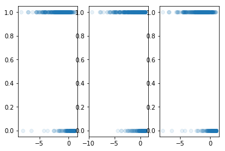


### Perform single varaible transformation with MonoLogitTrans


```python
importlib.reload(MonoLogitTrans)
MonoLogitTrans1 = MonoLogitTrans.MonoLogitTrans(method='strict')
MonoLogitTrans2 = MonoLogitTrans.MonoLogitTrans(method='wide')
MonoLogitTrans3 = MonoLogitTrans.MonoLogitTrans(method='wide',num_hidden=30)
time1 = time.time()
MonoLogitTrans1.fit(x1,y)
MonoLogitTrans2.fit(x2,y)
MonoLogitTrans3.fit(x3,y)
time2 = time.time()
print(time2-time1)

x1_trans = MonoLogitTrans1.transform(x1_test)
x2_trans = MonoLogitTrans2.transform(x2_test)
x3_trans = MonoLogitTrans3.transform(x3_test)
```

    
    WARNING: The TensorFlow contrib module will not be included in TensorFlow 2.0.
    For more information, please see:
      * https://github.com/tensorflow/community/blob/master/rfcs/20180907-contrib-sunset.md
      * https://github.com/tensorflow/addons
    If you depend on functionality not listed there, please file an issue.
    
    WARNING:tensorflow:From C:\Users\BBD\Anaconda3\lib\site-packages\tensorflow\python\framework\op_def_library.py:263: colocate_with (from tensorflow.python.framework.ops) is deprecated and will be removed in a future version.
    Instructions for updating:
    Colocations handled automatically by placer.
    6.544736385345459
    

**Save and load parameters**


```python
#save parameters
MonoLogitTrans1.save_parameter('./Docs/MonoLogitTrans1.txt')
MonoLogitTrans2.save_parameter('./Docs/MonoLogitTrans2.txt')
MonoLogitTrans3.save_parameter('./Docs/MonoLogitTrans3.txt')
#load parameters
MonoLogitTrans1_ = MonoLogitTrans.MonoLogitTrans()
MonoLogitTrans2_ = MonoLogitTrans.MonoLogitTrans()
MonoLogitTrans3_ = MonoLogitTrans.MonoLogitTrans()
MonoLogitTrans1_.load_parameter('./Docs/MonoLogitTrans1.txt')
MonoLogitTrans2_.load_parameter('./Docs/MonoLogitTrans2.txt')
MonoLogitTrans3_.load_parameter('./Docs/MonoLogitTrans3.txt')
x1_trans = MonoLogitTrans1_.transform(x1_test)
x2_trans = MonoLogitTrans2_.transform(x2_test)
x3_trans = MonoLogitTrans3_.transform(x3_test)
```

#### Make sure converge by looking at trace plot of loss


```python
plt.subplot(1,3,1)
plt.plot(MonoLogitTrans1.Loss)
plt.subplot(1,3,2)
plt.plot(MonoLogitTrans2.Loss)
plt.subplot(1,3,3)
plt.plot(MonoLogitTrans3.Loss)
plt.show()
```


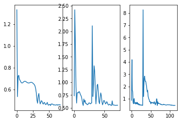


#### Comparision between original data (horizontal ordinate) and transformed data (vertical ordinate)

If method='wide', such as the last two varaibles, then the value of lambda_monotonous controls monotonicity.
The greater lambda_monotonous is, the more likely that the tranformation is monotone.

If method='strict', such as the first varaible, the tranformation would be guaranteed to be monotone.


```python
plt.subplot(1,3,1)
plt.plot(x1_test,x1_trans,'o',alpha=0.2)
plt.subplot(1,3,2)
plt.plot(x2_test,x2_trans,'o',alpha=0.2)
plt.subplot(1,3,3)
plt.plot(x3_test,x3_trans,'o',alpha=0.2)
plt.show()
```


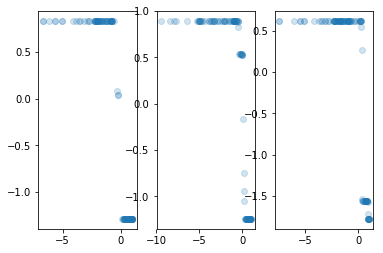


```python
MonoLogitTrans.PlotComparableHistogram(variable_=pd.Series(x1_trans),lable_=pd.Series(y_test))
MonoLogitTrans.PlotComparableHistogram(variable_=pd.Series(x1_test),lable_=pd.Series(y_test))
```


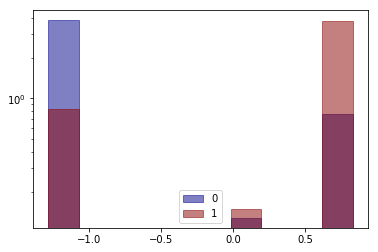


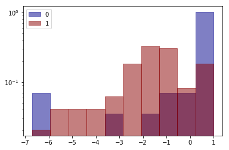


```python
MonoLogitTrans.PlotComparableHistogram(variable_=pd.Series(x2_trans),lable_=pd.Series(y_test))
MonoLogitTrans.PlotComparableHistogram(variable_=pd.Series(x2_test),lable_=pd.Series(y_test))
```


```python
MonoLogitTrans.PlotComparableHistogram(variable_=pd.Series(x3_trans),lable_=pd.Series(y_test))
MonoLogitTrans.PlotComparableHistogram(variable_=pd.Series(x3_test),lable_=pd.Series(y_test))
```


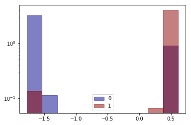


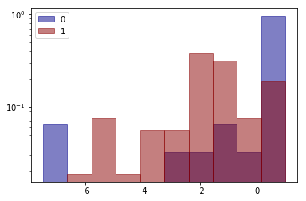


#### Obtain the test set of original data and transformed data


```python
x1_test = np.reshape(x1_test,(len(x1_test),1))
x2_test = np.reshape(x2_test,(len(x2_test),1))
x3_test = np.reshape(x3_test,(len(x3_test),1))
x1_trans = np.reshape(x1_trans,(len(x1_trans),1))
x2_trans = np.reshape(x2_trans,(len(x2_trans),1))
x3_trans = np.reshape(x3_trans,(len(x3_trans),1))

X_origin = np.concatenate((x1_test,x2_test,x3_test),axis=1)
X_trans = np.concatenate((x1_trans,x2_trans,x3_trans),axis=1)
```

### Modeling and comparision

Because all the transformed variables are positively correlated with P(y=1), it would be better to use PosLassoClassifierCV of LinearModel. 

For the original data, LogisticRegressionCV of sklearn is applied.


```python
model1 = LinearModel.PosLassoClassifierCV(beta_mean=True,start_point='OLS')
model1.fit(X_trans,y_test)
model2 = LogisticRegressionCV(cv=5)
model2.fit(X_origin,y_test)
```
#### Coefficients


```python
model1.coef_
```


    array([0.        , 2.81156039, 3.58124018])


```python
model2.coef_
```


    array([[-1.4170879 , -0.29881972,  0.61332106]])


#### Prediction


```python
y_hat_trans = model1.predict_proba(X_trans)
y_hat_origin = model2.predict_proba(X_origin)[:,1]
```


```python
from sklearn.metrics import roc_auc_score
```


```python
roc_auc_score(y_test,y_hat_trans)
```


    0.9703989703989704


```python
roc_auc_score(y_test,y_hat_origin)
```


    0.8601458601458601


```python
plt.subplot(1,2,1)
plt.plot(y_hat_trans,y_test,'bo',alpha=0.1)
plt.subplot(1,2,2)
plt.plot(y_hat_origin,y_test,'bo',alpha=0.1)
plt.show()
```


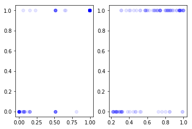


```python
MonoLogitTrans.PlotKS(y_hat_trans,y_test)
```

    ks_value is 0.8301 at pop = 0.55
    


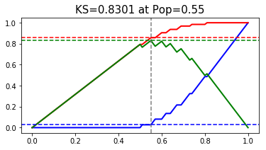


```python
MonoLogitTrans.PlotKS(y_hat_origin,y_test)
```

    ks_value is 0.668 at pop = 0.61
    


## Demonstrate the choice of start point of LinearModel


```python
model1 = LinearModel.LassoClassifierCV(beta_mean=True,start_point='ridge')
model1.fit(X_origin,y_test)
model2 = LinearModel.LassoClassifierCV(beta_mean=True,start_point=None)
model2.fit(X_origin,y_test)
y_hat_1 = model1.predict_proba(X_origin)
y_hat_2 = model2.predict_proba(X_origin)
```

#### Ridge estimator as the start point


```python
roc_auc_score(y_test,y_hat_1)
```


    0.8554268554268554


```python
model1.plotLoss()
```


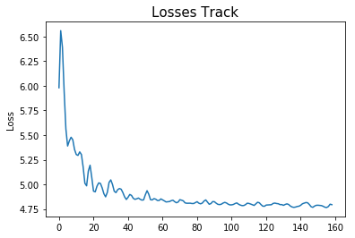


#### Random normal as the start point


```python
roc_auc_score(y_test,y_hat_2)
```


    0.8627198627198627


```python
model2.plotLoss()
```


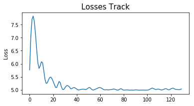


## Demonstrate the choice of Q0 and Q1 of LinearModel


```python
model1 = LinearModel.LassoClassifierCV(beta_mean=True,Q0=0.95,Q1=0.95,max_iter=300)
model1.fit(X_origin,y_test)
model2 = LinearModel.LassoClassifierCV(beta_mean=True,Q0=1,Q1=1)
model2.fit(X_origin,y_test)
y_hat_1 = model1.predict_proba(X_origin)
y_hat_2 = model2.predict_proba(X_origin)
```

#### Q0 and Q1 less than 1

which means the largest (1-Q0)*100% elements with label Y=0 and (1-Q1)*100% elements with label Y=1, before taking the mean


```python
roc_auc_score(y_test,y_hat_1)
```


    0.8717288717288717


```python
model1.plotLoss()
```


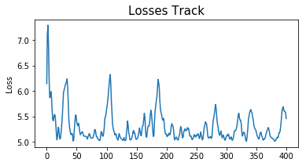


#### Q0 and Q1 equal to 1


```python
roc_auc_score(y_test,y_hat_2)
```


    0.8524238524238523


```python
model2.plotLoss()
```


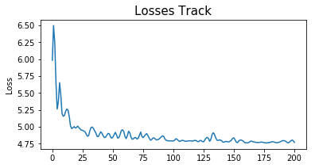


```python

```
